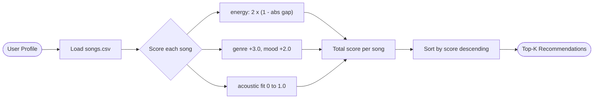

# 🎵 Music Recommender Simulation

## Project Summary

In this project you will build and explain a small music recommender system.

Your goal is to:

- Represent songs and a user "taste profile" as data
- Design a scoring rule that turns that data into recommendations
- Evaluate what your system gets right and wrong
- Reflect on how this mirrors real world AI recommenders

Replace this paragraph with your own summary of what your version does.

---

## How The System Works

Real-world music recommenders like Spotify combine two strategies. **Collaborative filtering** studies the behavior of millions of users — likes, skips, playlist additions — and finds people with similar histories to surface songs you would never have searched for yourself. **Content-based filtering** ignores other users entirely and instead looks at a song's own attributes — genre, mood, energy level, tempo — to match what a listener has already said they prefer. Spotify's Discover Weekly blends both: collaborative signals drive discovery while content-based signals handle new users and provide explainable results. This simulator focuses entirely on the **content-based** side: it compares a user's taste profile directly to each song's attributes and scores the match, then ranks the full catalog to surface the best fits. It prioritizes **genre** as the broadest taste boundary, **mood** for emotional context, and **energy** as the most context-sensitive numerical signal.

### Features used by `Song`

The catalog (`data/songs.csv`) now contains 20 songs. Each song carries these attributes:

- `genre` — categorical style label (pop, lofi, rock, ambient, jazz, synthwave, indie pop, r&b, hip-hop, folk, classical, reggae, metal, electronic, blues, country, soul)
- `mood` — intended emotional feel (happy, chill, intense, relaxed, focused, moody, romantic, energetic, melancholic, dreamy, nostalgic, playful)
- `energy` — float 0–1, how energetic the track feels
- `tempo_bpm` — beats per minute
- `valence` — float 0–1, musical positiveness / brightness
- `danceability` — float 0–1, how suitable the track is for dancing
- `acousticness` — float 0–1, how acoustic vs. electronic the sound is

### User Profile

The recommender is driven by this taste profile dictionary:

```python
user_prefs = {
    "genre": "rock",        # favorite genre — strongest filter
    "mood": "intense",      # desired emotional feel right now
    "energy": 0.85,         # target energy on a 0.0–1.0 scale
    "likes_acoustic": False # prefers electronic/produced sounds over acoustic
}
```

This profile can clearly distinguish "intense rock" (genre=rock, mood=intense, energy≈0.9) from "chill lofi" (genre=lofi, mood=chill, energy≈0.4) because all three dimensions — genre, mood, and energy — point in opposite directions for those two styles.

### Algorithm Recipe (Scoring Rule)

Each song is scored against the user profile using this formula:

```
score = (3.0 × genre_match)        # +3.0 if genre matches, else 0
      + (2.0 × mood_match)          # +2.0 if mood matches, else 0
      + (2.0 × energy_proximity)    # 2.0 × (1 − |song.energy − target_energy|)
      + (1.0 × acoustic_fit)        # song.acousticness if likes_acoustic, else 1 − acousticness
```

**Why these weights?**
Genre (3.0) is the outermost taste boundary — mismatched genre almost never produces a good recommendation regardless of other features. Mood (2.0) is the second most important signal because it captures the emotional context the user wants right now. Energy proximity (0–2.0) uses the formula `1 − |difference|` so songs *closer* to the user's target score higher — not simply louder or softer songs. Acousticness (0–1.0) is a tie-breaker that distinguishes organic, mellow sounds from electronic, produced ones.

### Data Flow (Ranking Rule)



The input is the user profile. Every song in the CSV is judged individually using the Scoring Rule. The resulting scores are collected and sorted — that is the Ranking Rule. Only the top-k survive to the output.

### Expected Biases

- **Genre over-prioritization:** Because genre carries 3.0 points (37.5% of the maximum score of 8.0), the system may suppress excellent songs that match mood and energy perfectly but belong to a different genre. A jazz song with the exact energy and mood a rock user wants will score far lower than a mediocre rock song.
- **Mood blind spots:** Moods like "energetic," "romantic," or "nostalgic" are only present in the expanded catalog. A user profile targeting a mood that appears in only one song will almost always return that one song at the top, regardless of other attributes.
- **Energy neutrality:** The proximity formula is symmetric — being 0.2 above or below the target gives the same score. A user who wants calm study music but tolerates slightly higher energy would receive the same recommendations as one who wants slightly lower energy, which may not reflect real listening preferences.
- **No diversity enforcement:** The Ranking Rule always returns the closest matches. If five lofi songs all score similarly, the top-5 could be entirely lofi with no variety, even if the user might enjoy occasional variety.

---

## Getting Started

### Setup

1. Create a virtual environment (optional but recommended):

   ```bash
   python -m venv .venv
   source .venv/bin/activate      # Mac or Linux
   .venv\Scripts\activate         # Windows

2. Install dependencies

```bash
pip install -r requirements.txt
```

3. Run the app:

```bash
python -m src.main
```

### Running Tests

Run the starter tests with:

```bash
pytest
```

You can add more tests in `tests/test_recommender.py`.

---

## Experiments You Tried

### Profile 1 — High-Energy Pop

```
Profile : High-Energy Pop
  genre=pop | mood=happy | energy=0.9 | acoustic=False
==============================================================
  #1  Sunrise City  (Score: 7.66)
       genre match 'pop' (+3.0); mood match 'happy' (+2.0); energy proximity 0.82 vs 0.90 (+1.84); electronic fit (0.18) (+0.82)
  #2  Gym Hero  (Score: 5.89)
       genre match 'pop' (+3.0); energy proximity 0.93 vs 0.90 (+1.94); electronic fit (0.05) (+0.95)
  #3  Rooftop Lights  (Score: 4.37)
       mood match 'happy' (+2.0); energy proximity 0.76 vs 0.90 (+1.72); electronic fit (0.35) (+0.65)
```

Sunrise City is a correct pick — pop, happy mood, energy 0.82 (very close to the target of 0.90). Gym Hero appearing at #2 is a surprise: it is pop genre but its mood is "intense", the opposite of "happy". It ranks ahead of Rooftop Lights (#3), which correctly matches the happy mood, purely because the genre bonus of 3.0 outweighs the missed mood.

### Profile 2 — Chill Lofi

```
Profile : Chill Lofi
  genre=lofi | mood=chill | energy=0.35 | acoustic=True
==============================================================
  #1  Library Rain  (Score: 7.86)
       genre match 'lofi' (+3.0); mood match 'chill' (+2.0); energy proximity 0.35 vs 0.35 (+2.00); acoustic fit (0.86) (+0.86)
  #2  Midnight Coding  (Score: 7.57)
       genre match 'lofi' (+3.0); mood match 'chill' (+2.0); energy proximity 0.42 vs 0.35 (+1.86); acoustic fit (0.71) (+0.71)
  #3  Focus Flow  (Score: 5.68)
       genre match 'lofi' (+3.0); energy proximity 0.40 vs 0.35 (+1.90); acoustic fit (0.78) (+0.78)
```

The cleanest result of any profile. Library Rain scores a perfect energy match (exact hit at 0.35) and high acousticness. The top three are all lofi — but that also means there is no variety at all.

### Profile 3 — Intense Rock

```
Profile : Intense Rock
  genre=rock | mood=intense | energy=0.95 | acoustic=False
==============================================================
  #1  Storm Runner  (Score: 7.82)
       genre match 'rock' (+3.0); mood match 'intense' (+2.0); energy proximity 0.91 vs 0.95 (+1.92); electronic fit (0.10) (+0.90)
  #2  Iron Curtain  (Score: 4.92)
       mood match 'intense' (+2.0); energy proximity 0.97 vs 0.95 (+1.96); electronic fit (0.04) (+0.96)
  #3  Gym Hero  (Score: 4.91)
       mood match 'intense' (+2.0); energy proximity 0.93 vs 0.95 (+1.96); electronic fit (0.05) (+0.95)
```

Storm Runner is the only rock song in the catalog, so it wins by a wide margin. Iron Curtain (metal) and Gym Hero (pop) both earn #2/#3 through mood and energy matching — which is actually useful cross-genre discovery.

### Profile 4 — Adversarial: Classical + Energetic + High Energy

```
Profile : Adversarial: Classical + Energetic + High Energy
  genre=classical | mood=energetic | energy=0.90 | acoustic=True
==============================================================
  #1  Cathedral Silence  (Score: 4.61)
       genre match 'classical' (+3.0); energy proximity 0.22 vs 0.90 (+0.64); acoustic fit (0.97) (+0.97)
  #2  Pulse Nation  (Score: 4.03)
       mood match 'energetic' (+2.0); energy proximity 0.90 vs 0.90 (+2.00); acoustic fit (0.03) (+0.03)
  #3  Concrete Jungle  (Score: 4.02)
       mood match 'energetic' (+2.0); energy proximity 0.87 vs 0.90 (+1.94); acoustic fit (0.08) (+0.08)
```

This profile is designed to expose a flaw: a user who asks for high-energy classical music. Cathedral Silence — a dreamy, near-silent piece with energy 0.22 — wins #1 purely because the genre bonus (3.0 points) overrides a terrible energy match. Pulse Nation (electronic, energetic, energy 0.90) is a much better fit in every measurable way but loses because it is not "classical."

### Experiment — Weight Shift (genre 3.0→1.5, energy 2.0→4.0)

Doubling the energy weight and halving the genre weight for the adversarial profile:

```
  #1  Pulse Nation  (Score: 6.03)   ← correctly ranks first now
  #2  Concrete Jungle  (Score: 5.96)
  #3  Storm Runner  (Score: 4.06)
  Cathedral Silence dropped out of the top 5 entirely
```

The experiment fixes the adversarial case. However, for the High-Energy Pop profile the ranking order is identical to the baseline — Sunrise City still #1, Gym Hero still #2. This means the original weights are defensible for well-formed profiles; the adversarial case is the edge that reveals the genre weight is too absolute.

---

## Limitations and Risks

Summarize some limitations of your recommender.

Examples:

- It only works on a tiny catalog
- It does not understand lyrics or language
- It might over favor one genre or mood

You will go deeper on this in your model card.

---

## Reflection

Read and complete `model_card.md`:

[**Model Card**](model_card.md)

A recommender system turns data into predictions by reducing something as subjective as musical taste into a set of numbers, then doing arithmetic. VibeFinder assigns a score to every song based on how closely its genre, mood, energy, and acousticness match what the user stated. The song with the highest total wins. What makes this feel like a recommendation — and not just a search filter — is the energy proximity formula: rather than asking "is this high energy?", it asks "is this the *right* energy for this user right now?". That small shift from absolute values to relative closeness is what allows the same system to correctly serve a chill lofi listener at 0.35 energy and a high-energy pop listener at 0.90. The sorting step, which takes individual scores and turns them into a ranked list, is where the prediction actually happens.

Bias enters the moment you assign weights. Choosing genre to be worth 3.0 points and mood to be worth 2.0 is a value judgment — it encodes the assumption that *what kind of music* matters more than *how the music makes you feel*. For most profiles that assumption holds, but the adversarial test (classical + energetic + high energy) revealed how badly it breaks at the edges: Cathedral Silence, a nearly silent dreamy piece, was recommended to someone who asked for high-energy music, simply because it won the genre match. In a real product serving millions of users, that kind of edge-case failure would be invisible in aggregate metrics but immediately felt by the affected users — who would likely be listeners whose musical taste doesn't fit the dominant patterns in the training data. This is where algorithmic unfairness hides: not in obviously wrong results, but in results that are wrong for the users least represented in the data the system was designed around.


---

## 7. `model_card_template.md`

Combines reflection and model card framing from the Module 3 guidance. :contentReference[oaicite:2]{index=2}  

```markdown
# 🎧 Model Card - Music Recommender Simulation

## 1. Model Name

Give your recommender a name, for example:

> VibeFinder 1.0

---

## 2. Intended Use

- What is this system trying to do
- Who is it for

Example:

> This model suggests 3 to 5 songs from a small catalog based on a user's preferred genre, mood, and energy level. It is for classroom exploration only, not for real users.

---

## 3. How It Works (Short Explanation)

Describe your scoring logic in plain language.

- What features of each song does it consider
- What information about the user does it use
- How does it turn those into a number

Try to avoid code in this section, treat it like an explanation to a non programmer.

---

## 4. Data

Describe your dataset.

- How many songs are in `data/songs.csv`
- Did you add or remove any songs
- What kinds of genres or moods are represented
- Whose taste does this data mostly reflect

---

## 5. Strengths

Where does your recommender work well

You can think about:
- Situations where the top results "felt right"
- Particular user profiles it served well
- Simplicity or transparency benefits

---

## 6. Limitations and Bias

Where does your recommender struggle

Some prompts:
- Does it ignore some genres or moods
- Does it treat all users as if they have the same taste shape
- Is it biased toward high energy or one genre by default
- How could this be unfair if used in a real product

---

## 7. Evaluation

How did you check your system

Examples:
- You tried multiple user profiles and wrote down whether the results matched your expectations
- You compared your simulation to what a real app like Spotify or YouTube tends to recommend
- You wrote tests for your scoring logic

You do not need a numeric metric, but if you used one, explain what it measures.

---

## 8. Future Work

If you had more time, how would you improve this recommender

Examples:

- Add support for multiple users and "group vibe" recommendations
- Balance diversity of songs instead of always picking the closest match
- Use more features, like tempo ranges or lyric themes

---

## 9. Personal Reflection

A few sentences about what you learned:

- What surprised you about how your system behaved
- How did building this change how you think about real music recommenders
- Where do you think human judgment still matters, even if the model seems "smart"

